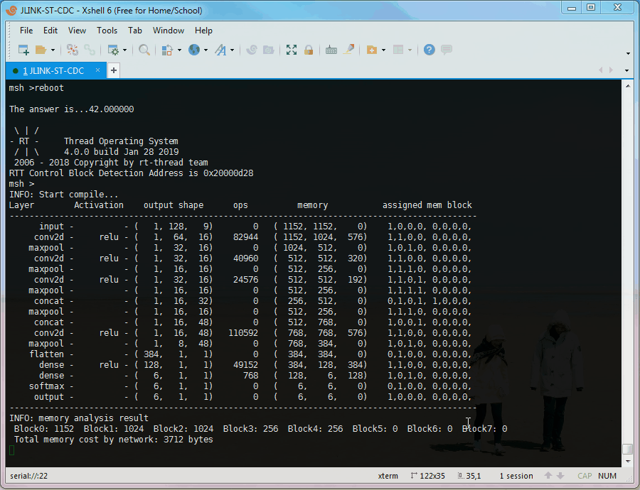

The simplest first.
# Deploying

Deploying is much easier than before. (Thanks to @parai)

Simply use `generate_model(model, x_data)` to generate a C header `weights.h` after you have trained your model in Keras. It is available in  [nnom_utils.py](https://github.com/majianjia/nnom/blob/master/scripts/nnom_utils.py)

Include the `weights.h` in your project, then call `nnom_model_create()` to create and compile the model on the MCU. Finaly, call `model_run()` to do your prediction.

Please check [MNIST-DenseNet](https://github.com/majianjia/nnom/tree/master/examples/mnist-densenet) example for usage

> The `generate_model(model, x_data)` might not be updated with NNoM from time to time. For new features and customized layers, you can still use NNoM APIs to build your model. 

# NNoM Structure

NNoM uses a layer-based structure. 

A layer is a container. Every operation (convolution, concat...) must be wrapped into a layer. 

A basic layer contains a list of **Input/Ouput modules** (I/O). Each of I/O contains a list of **Hook** (similar to Nodes in Keras).

**Hook**  stores the links to an I/O (other layer's)

**I/O** is a buffer to store input/output data of the operation. 

Dont be scared, check this:

Those APIs listed below will help you to create layers and build the model structures.  

# APIs
**Layer APIs** and **Construction APIs** are used to build a model. 

Layer APIs can create and return a new layer instance, while construction APIs use layer instances to build a model. 

**Layer APIs** such as `Conv2D(), Dense(), Activation()` ... which you can find in *nnom_layers.h*

**Construction APIs** such as `model.hook(), model.merge(), model.add()` ... which you can find in `new_model()` at *nnom.c*

For example, to add a convolution layer into a sequencial model, use `model.add()`:
~~~c
model.add(&model, Conv2D(16, kernel(1, 9), stride(1, 2), PADDING_SAME, &c1_w, &c1_b));
~~~

In functional model, the links between layer are specified explicitly by using `model.hook() or model.merge()`
~~~c
x = model.hook(Conv2D(16, kernel(1, 9), stride(1, 2), PADDING_SAME, &c1_w, &c1_b), input_layer);
x = model.hook(MaxPool(kernel(1, 2), stride(1, 2), PADDING_VALID), x);
~~~

NNoM currently supports HWC format. 

Which also called "channel last", where H = number of rows or y axis, W = number of column or x axis, C = number of channes. 

> For example:
>
> In the above codes, both `kernal(H, W)` and `stride(H, W)` returns a 'shape' instance.
> The shape instance in format of (H, W, ?)

All convolutional layers and poolings layers support both 1D / 2D data input. 
However, when using 1D input, the H must be set to 1. 

## Construction APIs
Construction APIs are statics functions located in nnom.c

Currently are:

Sequencial Construction API 
~~~c
nnom_status_t model.add(nnom_model_t* model,  nnom_layer_t *layer);
~~~

Functional Construction API

~~~c
// hook the current layer to the input layer
// this function only to connect (single output layer) to (single input layer). 
// return the curr (layer) instance
nnom_layer_t * model.hook(nnom_layer_t* curr, nnom_layer_t *last)
~~~

~~~c
// merge 2 layer's output to one output by provided merging method(a mutiple input layer)
// method = merging layer such as (concat(), dot(), mult(), add())
// return the method (layer) instance
nnom_layer_t * model.merge(nnom_layer_t *method, nnom_layer_t *in1, nnom_layer_t *in2)
~~~

~~~c
// Same as model.merge()
// Except it can take mutiple layers as input. 
// num = the number of layer
// method: same as model.merge()
nnom_layer_t * model.mergex(nnom_layer_t *method, int num, ...)
~~~

~~~c
// This api will merge the activation to the targeted layerto reduce an extra activation layer
// activation such as (act_relu(), act_tanh()...)
nnom_layer_t * model.active(nnom_activation_t* act, nnom_layer_t * target)
~~~
For `model.active()`, please check Activation APIs below. 

## Layer APIs

Layers APIs are listed in *nnom_layers.h*

Input/output layers are neccessary for a model. They are responsible to copy data from user's input buffer, and copy out to user's output buffer. 
~~~c
// Layer APIs 
// input/output
nnom_layer_t* Input(nnom_shape_t input_shape，void* p_buf);
nnom_layer_t* Output(nnom_shape_t output_shape, void* p_buf);
~~~

Pooling as they are:

>The sum pooling here will dynamicly change its ourput shift to avoid overflowing. 
>
>It is recommened to replace the Global Average Pooling by Global Sum Pooling for better accuracy in MCU side. 
~~~c
// Pooling, kernel, strides, padding
nnom_layer_t* MaxPool(nnom_shape_t k, nnom_shape_t s, nnom_padding_t pad);
nnom_layer_t* AvgPool(nnom_shape_t k, nnom_shape_t s, nnom_padding_t pad);
nnom_layer_t* SumPool(nnom_shape_t k, nnom_shape_t s, nnom_padding_t pad);

// The Global poolings simplly do better 
nnom_layer_t *GlobalMaxPool(void);
nnom_layer_t *GlobalAvgPool(void);
nnom_layer_t *GlobalSumPool(void);

// Upsampling layer / Unpooling layer
nnom_layer_t* UpSample(nnom_shape_t kernel);

~~~

Activation's **Layers API** are started with capital letter. They are differed from the **Activation API**, which start with `act_*` and retrun an activation instance.
Pleas check the Activation APIs below for more detail. 

They return a **layer** instance. 
~~~c
// Activation layers take activation instance as input.  
nnom_layer_t* Activation(nnom_activation_t *act);		

// Activation's layer API. 
nnom_layer_t* ReLU(void);
nnom_layer_t* Softmax(void);
nnom_layer_t* Sigmoid(void);
nnom_layer_t* TanH(void);
~~~

Matrix API. 

These layers normally take 2 or more layer's output as their inputs. 

They also called "merging method", which must be used by `model.merge(method, in1, in2)`or `model.mergex(method, num of input, in1, in2, 1n3 ...)`
~~~c
// Matrix
nnom_layer_t* Add(void);
nnom_layer_t* Sub(void);
nnom_layer_t* Mult(void);
nnom_layer_t* Concat(int8_t axis);
~~~

Flatten change the shapes to (x, 1, 1)
~~~c
// utils
nnom_layer_t* Flatten(void);
~~~

Stable NN layers.
For more developing layers, please check the source codes. 

~~~c
// conv1D/2d
nnom_layer_t* Conv2D(uint32_t filters, nnom_shape_t k, nnom_shape_t s, nnom_padding_t pad,
	nnom_weight_t *w, nnom_bias_t *b);

// depthwise_convolution 1D/2D
nnom_layer_t* DW_Conv2D(uint32_t multiplier, nnom_shape_t k, nnom_shape_t s, nnom_padding_t pad, 
	nnom_weight_t *w, nnom_bias_t *b);

// fully connected, dense
nnom_layer_t* Dense(size_t output_unit, nnom_weight_t *w, nnom_bias_t *b);

// Lambda Layers
// layer.run()   , required
// layer.oshape(), optional, call default_output_shape() if left NULL
// layer.free()  , optional, called while model is deleting, to free private resources
// parameters    , private parameters for run method, left NULL if not needed.
nnom_layer_t *Lambda(nnom_status_t (*run)(nnom_layer_t *),	
		nnom_status_t (*oshape)(nnom_layer_t *), 
		nnom_status_t (*free)(nnom_layer_t *),   
		void *parameters);						  
~~~

About the missing **Batch Normalization Layer**

Batch Normalization layer can be fused into the last convolution layer. So NNoM currently does not provide a Batch Normalization Layer. It might be implemented as a single layer in the future. However, currently, please fused it to the last layer.

[Further reading about fusing BN parameters to conv weights](https://tkv.io/posts/fusing-batchnorm-and-conv/)

[Fusing batch-norm layers](https://github.com/ARM-software/ML-KWS-for-MCU/blob/master/Deployment/Quant_guide.md#fusing-batch-norm-layers)

## Addictionlly, Activation APIs
 
Actication APIs are not essential in the original idea. The original idea is making eveything as a layer. 

However, single layer instances cost huge amount of memories(100~150 Bytes), while activations are relativly simple, mostly have same input/output shape, a few/none parameter(s)...

Therefore, to reduce the complexity, the "actail"(activation tail) is added to each layer instance. If a layer's Actail is not null, it will be called right after the layer is executed. Actail takes activation instance as input. The model API, `model.active()` will attach the activation to the layer's actail. 

~~~c
// attach act to target_layer, return the target layer instance.
nnom_layer_t * model.active(nnom_activation_t* act, nnom_layer_t * target_layer)
~~~
 
The Activation APIs are listed in *nnom_activations.h*

~~~c
// Activation
nnom_activation_t* act_relu(void);
nnom_activation_t* act_sigmoid(void);
nnom_activation_t* act_tanh(void);
~~~
 
 
## Model API

A model instance contains the starting layer, the end layer and other neccessary info. 

Please refer to the examples for usage

~~~c
// Create or initial a new model() 
nnom_model_t* 	new_model(nnom_model_t* m);

// Delete the model completely (new). 
void model_delete(nnom_model_t* m);  

// Compile a sequencial model. 
nnom_status_t 	sequencial_compile(nnom_model_t *m);

// Compile a functional model with specified input layer and output layer. 
// if output = NULL, the output is automatic selected. 
nnom_status_t 	model_compile(nnom_model_t *m, nnom_layer_t* input, nnom_layer_t* output);

// Run the model.
nnom_status_t 	model_run(nnom_model_t *m);
~~~

## Known Issues

### Shared output buffer destroyed by single buffer layers (input-destructive)
Single buffer layers (Such as most of the Activations, additionally MaxPool/AvgPool) are working directly on its input buffer. While its input buffer is shared with other parallel layers, and it is placed before other layers in a parallel structure (such as Inception), the shared buffer will be destroyed by those input-destructive before other parallel layer can access it. 

Additionally, although, MaxPool & AvgPool are not single buffer layers, they will destroy the input buffer as they are mentioned with input-destructive layers in CMSIS-NN. So they should be treated as same as single buffer layers. 

**Fix plan of the issue**

Not planned. 

Possiblly, add an invisible copying layer/functions to copy data for single input layer before passing to other parallel layers. 

**Current work around**

**Work around 1** 

If the Inception has only one single buffer layer, always hook the single buffer layer at the end. For example, instead of doing `MaxPool - Conv2D - Conv2D`, do `Conv2D - Conv2D - MaxPool`

~~~C
// the codes are faked and simplified, please rewrite them according to corresponding APIs. 

// original
x1 = model.hook(MaxPool(), input); // Single buffer layer, this will destroyed the buffer
x2 = model.hook(Conv2D(), input);  // buffer destroyed.
x3 = model.hook(Conv2D(), input);  // buffer destroyed.
output = model.mergex(Concat(-1), 3, x1, x2, x3);

// This will fixed the problem without affacting the concatenate order.
// notice that the order of x1,x2,x3 will change, 
// the different is the order that the inception layers hooked to the input layer. 
x3 = model.hook(Conv2D(), input);  // multiple buffers layer
x2 = model.hook(Conv2D(), input);  // 
x1 = model.hook(MaxPool(), input); // this will destroyed the buffer, but it doesnt matter now. 
output = model.mergex(Concat(-1), 3, x1, x2, x3);
	
~~~

**Work around 2** 

If there is multiple, add an extra multiple bufer layer before the single buffer layer. Such as using Lambda() layer to copy buffer.
~~~C
// the codes are faked and simplified, please rewrite them according to corresponding APIs. 

lambda_run(layer)
{
    memcpy(layer->output, layer->input, sizeof(inputshape);
}

x1 = model.hook(Lambda(lambda_run), input); // add a lambda to copy data
x1 = model.hook(MaxPool(), x1);  	    // now it is only destroying Lambda's output buffer instead of the input layer's. 

x2 = model.hook(Lambda(lambda_run), input); // add a lambda to copy data
x2 = model.hook(MaxPool(), x2); 

x3 = model.hook(Conv2D(), input);  
output = model.mergex(Concat(-1), 3, x1, x2, x3);
		
~~~

# Evaluation

The evaluation methods are listed in `nnom_utils.h`

They run the model with testing data, then evaluate the model. Includes Top-k accuracy, confusion matrix, runtime stat...

Please refer to [UCI HAR example](../examples/uci-inception) for usage. 
~~~c
// create a prediction
// input model, the buf pointer to the softwmax output (Temporary, this can be extract from model)
// the size of softmax output (the num of lable)
// the top k that wants to record. 
nnom_predic_t* prediction_create(nnom_model_t* m, int8_t* buf_prediction, size_t label_num, size_t top_k_size);// currently int8_t 

// after a new data is set in input
// feed data to prediction
// input the current label, (range from 0 to total number of label -1)
// (the current input data should be set by user manully to the input buffer of the model.)
// return NN_ARGUMENT_ERROR if parameter error
int32_t prediction_run(nnom_predic_t *pre, uint32_t label);

// to mark prediction finished
void prediction_end(nnom_predic_t *pre);

// free all resources
void predicetion_delete(nnom_predic_t *pre);

// print matrix
void prediction_matrix(nnom_predic_t *pre);

// print top-k
void prediction_top_k(nnom_predic_t *pre);

// this function is to print sumarry
void prediction_summary(nnom_predic_t *pre);

// -------------------------------

// stand alone prediction API
// this api test one set of data, return the prediction
// input the model's input and output bufer
// return the predicted label
// return NN_ARGUMENT_ERROR if parameter error
int32_t nnom_predic_one(nnom_model_t *m, int8_t *input, int8_t *output); // currently int8_t

// print last runtime stat of the model
void model_stat(nnom_model_t *m);
~~~

## Demo of Evaluation

The UCI HAR example runs on RT-Thread, uses Y-Modem to receive testing dataset, uses ringbuffer to store data, and the console (msh) to print the results. 

The layer order, activation, output shape, operation, memory of I/O, and assigned memory block are shown. 
It also summarised the memory cost by neural network. 

Type `predic`, then use Y-Modem to send the data file. The model will run once enough data is received.

When the file copying done, the runtime summary, Top-k and confusion matrix will be printed

Optionally, the runtime stat detail of each layer can be printed by `nn_stat`

 
PS: The "runtime stat" in the animation is not correct, due to the test chip is overclocking (STM32L476 @ 160MHz, 2x overclocking), and the timer is overclocking as well. 

However, the numbers in prediction summary are correct, because they are measured by system_tick timer which is not overclocking. 
 

