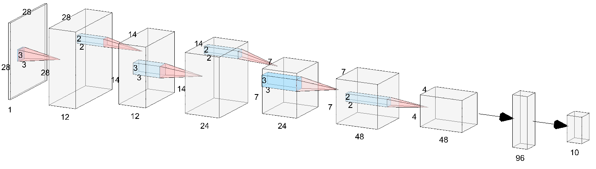

# MNIST-SIMPLE

[MNIST](http://yann.lecun.com/exdb/mnist/) 是一个手写数字库，由250个人的手写数字组成。每个数字被裁剪成 28 * 28 的灰度图片。

MNIST 经常被用来做为分类任务的入门数据库使用。在这个简单的例子里面，我们也用它来试试数据归类。 

这个例子建造了一个卷积网络，结构如上图。
这个网络主要包括卷积层（Convolution layer）和全连接层 (Densely-connected，或者也叫 Fully-connected layer). 
模型从左往右运行，最左边的是原始图像，长宽28x28，单通道灰度图像。然后经过3个卷积层和2个全链接层完成分类任务（识别10个数字）。

每一层通过一定大小的卷积核从上一层提取一定的特征。
这些特征最后通过全连接层选择后，会选择性激活10个类型中某个类型的标签。
这些标签对应的数值越大，可能性越大。

## 1. 下载并启用NNoM

在 RT-Thread 的包管理中

~~~
RT-Thread online packages  --->
    miscellaneous packages  --->
        [*] NNoM: A Higher-level Nerual Network ...	--->

*选择 latest 版本
*需要打开 msh 支持		
~~~

此外，默认移植文件和本例子依赖 libc， 所以需要打开 RT-Thread 的 libc 支持:

~~~
RT-Thread Components  --->
    POSIX layer and C standard library  --->
        [*] Enable libc APIs from toolchain ...	--->
~~~
*如果遇到问题或者环境不允许使用 libc，请看 [Appendix](#appendix)*

源码请到[GitHub](https://github.com/majianjia/nnom)

## 2. 复制例子文件

把 `packages/nnom-latest/examples/mnist-simple/mcu` 目录下的三个文件 `image.h`, `weights.h`和 `main.c` 复制到工程目录的 `application/`。替换掉默认的 `main.c`。先不用管这三个文件的内容。

（如果你是好奇宝宝：）

- `image.h` 里面放置了 10 张从 MNIST 数据集里面随机挑选的图片。
- `weights.h` 是 NNoM 的工具脚本自动生成的模型参数。
- `main.c` 包含了最简单的模型初始化和 msh 交互命令。

## 3. 跑起来

用你喜欢的方式，编译，下载，运行

### 3.1 模型编译

RT-Thread 启动后，接着会在 `main()`函数里面调用 `model = nnom_model_create();`。
这条语句将会载入我们藏在 `weights.h` 里面的模型，将它编译并把信息打印出来。

~~~
 \ | /
- RT -     Thread Operating System
 / | \     4.0.0 build Mar 29 2019
 2006 - 2018 Copyright by rt-thread team
RTT Control Block Detection Address is 0x20000a8c
msh >
INFO: Start compile...
Layer        Activation    output shape      ops          memory            mem life-time
----------------------------------------------------------------------------------------------
 Input      -          - (  28,  28,   1)        0   (  784,  784,    0)    1 - - -  - - - - 
 Conv2D     - ReLU     - (  28,  28,  12)    84672   (  784, 9408,  432)    1 1 - -  - - - - 
 MaxPool    -          - (  14,  14,  12)        0   ( 9408, 2352,    0)    1 - 1 -  - - - - 
 Conv2D     - ReLU     - (  14,  14,  24)   508032   ( 2352, 4704,  864)    1 1 - -  - - - - 
 MaxPool    -          - (   7,   7,  24)        0   ( 4704, 1176,    0)    1 - 1 -  - - - - 
 Conv2D     - ReLU     - (   7,   7,  48)   508032   ( 1176, 2352, 1728)    1 1 - -  - - - - 
 MaxPool    -          - (   4,   4,  48)        0   ( 2352,  768,    0)    1 - 1 -  - - - - 
 Dense      - ReLU     - (  96,   1,   1)    73728   (  768,   96,  768)    1 1 - -  - - - - 
 Dense      -          - (  10,   1,   1)      960   (   96,   10,   96)    1 - 1 -  - - - - 
 Softmax    -          - (  10,   1,   1)        0   (   10,   10,    0)    - 1 - -  - - - - 
 Output     -          - (  10,   1,   1)        0   (   10,   10,    0)    1 - - -  - - - - 
----------------------------------------------------------------------------------------------
INFO: memory analysis result
 Block0: 1728  Block1: 2352  Block2: 9408  Block3: 0  Block4: 0  Block5: 0  Block6: 0  Block7: 0  
 Total memory cost by network buffers: 13488 bytes
~~~

这里面的信息有：

- 模型有三个卷积层组成，每个卷积层都使用 ReLU 进行激活 （ReLU： 大于0的数值不变，小于0的数值重新赋值为0）。
- 三个卷积后面跟着两个 Dense 层 （Densely-connected，或者也叫 fully-connected 全连接层）。
- 最后模型通过 Softmax 层来输出 （将数值转换成概率值）
- 各层的内存信息，输出的数据，计算量 （定点乘加操作：MAC-OPS）
- 总网络内存占用 13488 bytes

### 3.2 跑个模型

之前我们介绍过 `image.h` 里面藏有十张图片。我们现在可以通过 `mnist` 这个自定义的 MSH 命令来预测一下这十张图。

命令使用方法如下, num 是 0~9 里面的任意数字。代表十张图片里面的第几个图片（注意：输入的数字并非指图片的数字，图片是随机拉取的）。

`mnist num`

我输入了 `msh >mnist 6`，我要测试第六张图片。

~~~
msh >mnist 6

prediction start.. 
                                                        
                                                        
                                                        
                                                        
                                                        
                                ..]]  ((ZZOO))^^        
                          ``//qq&&))  kkBB@@@@ff        
                    "">>\\pp%%ZZ,,    [[%%@@BB11        
                ^^}}MM@@@@oo{{      rr@@@@OO<<          
                nn@@@@aajj..    ++dd@@88nn''            
              \\%%@@hh!!      ++88@@oo::                
            !!%%@@kk>>      ;;88@@oo::                  
            ))@@@@<<      ^^pp@@oo::                    
            ::oo@@WWzzll!!bb@@bb''                      
              ttBB@@@@%%WW@@**,,                        
                ll}}LL%%@@@@@@bbtt''                    
                    ``&&@@MMCC&&%%hh[[                  
                    ((@@@@((    II**@@nn''              
                    ??@@##``        QQ@@>>              
                    ((@@@@^^        [[@@pp              
                    [[@@@@^^        nn@@jj              
                    ..aa@@[[        ZZ%%++              
                      __@@**,,    xx@@OO                
                        {{&&**jj00@@aa::                
                          ^^YYpppp||,,                  
                                                        
                                                        
                                                        
Time: 62 tick
Truth label: 8
Predicted label: 8
Probability: 100%

~~~

额，如果恶心到你了，那我道歉...

不要怀疑，上面那一坨是 ASCII 码表示的 28 * 28 的手写图片...

输出的信息里面记录了

- 此次预测的时间，这里用了 `62 tick`，我这是相当于 62ms
- 这张图片的真实数字是 `8`
- 网络计算的这张照片的数字 `8`
- 可能性是100%

赶快去试试，其他的 9 张图片吧。

简单的体验就到这。

## 4 建立自己的模型

对于没有机器学习基础的同学，想要在 MCU 上跑自己的模型，需要先学会在 Keras 里面建立一个模型。

在这里可以参照网络上 Keras 的教程来修改这个例子里面的模型。

这个例子的模型在 `nnom/example/mnist-simple/model` 里面的 `mnist_simple.py`，请自行实践。

*需要把 `nnom/scripts` 下的几个 python 脚本文件复制到以上目录。

环境是 Python3 + Keras + Tensorflow。推荐使用 Anaconda 来安装 python 环境而不是 pip。

模型训练完成后，会生成 `weights.h` 还会生成随机图片文件 `image.h`。 接下来按照上面的操作从头来一遍就好。

## 5 结语

使用 NNoM 来部署神经网络真的很简单。基础的代码不过两三行，NNoM 能轻松让你的 MCU 也神经一把~ 变成真正的 Edge AI 设备。

这个例子仅使用了最简单的 API 搭建了最基础的卷积模型。

高级用法和更多例子请查看[API 文档](https://majianjia.github.io/nnom/)和[其他例子](https://github.com/majianjia/nnom/tree/master/examples)

## Appendix

如果无法打开 libc 支持，或者你的工程不允许打开 libc 支持，可以通过简单的移植完全去掉 nnom 对 libc 依赖。

- 首先把`application/main.c` 里面所有的 `printf` 替换成 RTT 对应的版本 `rt_kprinf`.
- 然后，修改移植文件 `packages/nnom-latest/port`， 把里面的c标准接口改为rtt对应的接口。（也就是在 `malloc(), free(), memset(), printf()` 前面加上`rt_` 前缀。记得在他们之前加入rtt的头文件`rtthread.h`。）

觉得麻烦可以直接复制下面的代码，替换掉对应的部分。
~~~
#include "rtthread.h"
// memory interfaces
#define nnom_malloc(n)   	rt_malloc(n) 
#define nnom_free(p)		rt_free(p)
#define nnom_memset(p,v,s)	rt_memset(p,v,s)

// runtime & debuges
#define nnom_us_get()		0
#define nnom_ms_get()		0
#define NNOM_LOG(...)		rt_kprintf(__VA_ARGS__)
~~~

到此，这个例子和 nnom 就完全脱离 libc 依赖啦。现在可以尝试重新编译运行了。

