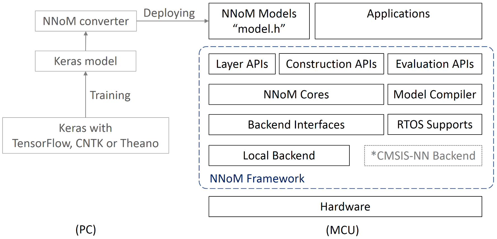

# NNoM

NNoM (Neural Network on Microcontroller)

## 1. 简介



NNoM是一个专门为了神经网络在 MCU 上运行的框架。 
NNoM 是一个定点神经网络库， 现在支持 8-bit定点格式。
当前 NNoM 支持数十种操作，卷积，池化，激活，矩阵计算等等。
此外还提供多种在线评估方法，包括时间统计，内存统计，Top-K 准确度，Confusion Matrix 等等。

它拥有以下优点：

- **快速开发**： 电脑上训练的 Keras 模型直接转换成 C 文件。 
- **默认纯C后端**： 移植和使用畅通无阻，支持32/64bit，MCU/PC。
- **支持复杂结构**： 支持多种复杂的网络模型结构。
- **完善的文档**： 拥有 API 文档，入门指南，优化指南。
- **入门简单**： 多个从简单到复杂的例子，完全开源。

**MCU 上的神经网络能做什么？**

- 语音关键词识别 （KeyWord Spotting）
- 使用运动传感器识别活动状态 （Human Activity Recognition）
- 神经网络控制系统 （替代PID等传统控制方法）
- 图像处理 （带专用加速器的 MCU）
- ...


** 为什么需要 NNoM **


2014年后的网络，更高效，也更复杂。

CMSIS-NN 之类的库太底层，需要设置的参数众多，不够灵活，只能应用在比较传统的单路径网络上。
而新的网络倾向于从结构上做优化，不可避免地需要在结构上做设计和优化。
复杂的网络结构导致非常难以使用传统的底层库进行部署。 
最初，NNoM 在 CMSIS-NN 上封装了一层结构层专门用于处理复杂的网络路径并且简化了参数计算。
后来 NNoM 有了自己的脚本可以一键生成相应的 C 文件，更进一步提升了使用性。
新的纯 C 后端也使得使用 NNoM 后，网络的部署几乎没有平台的限制。

### 1.1 目录结构

``` 
nnom
├───docs 
│   ├───figures                     // 文档图片
│   └───*.md                        // 文档
├───examples                        // 例子
├───inc                             // 头文件
├───port                            // 移植文件
├───scripts                         // 脚本工具，模型转换工具
├───src                             // 源代码
│   LICENSE                         // 软件包许可证
│   README.md                       // 软件包简介
└───SConscript                      // 构建脚本
```

* 在线文档 [https://majianjia.github.io/nnom/](https://majianjia.github.io/nnom/)

### 1.2 许可证

NNoM 使用 Apache License 2.0 许可证，详见LICENSE文件。

### 1.3 依赖

RT-Thread 3.0+

## 2. 获取软件包

~~~
RT-Thread online packages  --->
    miscellaneous packages  --->
        [*] NNoM: A Higher-level Nerual Network ...	--->
~~~
* 推荐选择 latest 版本。
* 退出 menuconfig 后，需要使用`pkgs --update` 命令下载软件包。

## 3. 使用软件包

从[[例子]](https://github.com/majianjia/nnom/tree/master/examples) 开始，例子从浅到深，适合直接硬干的玩家。

从[[在线文档]](https://majianjia.github.io/nnom/)开始，适合规规矩矩的大佬。


### 3.1 背景知识

- Python 3 环境，推荐 Anaconda
- 神经网络和机器学习的基本知识

在 MCU 上做神经网络需要使用者具备一些简单的机器学习的概念，比如卷积层，全连接层， 和 [Keras](https://keras.io/zh/) 或是其他工具的初步技巧。

NNoM 可以使用自带的 python 脚本很好地配合 Keras 来部署神经网络到 MCU。所以推荐使用 Keras 来学习。

如果你对机器学习和神经网络完全陌生也没有关系，[Keras](https://keras.io/zh/) 号称30秒入门。 

### 3.2 例子

`/examples` 下有几个不同的例子。

- [[mnist-simple]](https://github.com/majianjia/nnom/tree/master/examples/mnist-simple) 手写数字识别 (超级简单，Msh 交互)
- [[uci-inception]](https://github.com/majianjia/nnom/tree/master/examples/uci-inception) 使用6轴运动传感器进行人体运动识别(Inception 结构， CMSIS-NN加速，使用Y-modem发送测试数据，支持 Msh命令行交互)
- [[mnist-densenet]](https://github.com/majianjia/nnom/tree/master/examples/mnist-densenet) 手写数字识别 (DenseNet 结构)


更多例子正在路上...

- 关键词识别例子(KeyWord Spotting)


### 3.3 优化

NNoM 默认使用纯 C 后端， 同时支持 CMSIS-NN/DSP 后端。选择 CMSIS 后端后，会有5倍左右的性能提升.

开启优化的方式可以查看 [Porting and optimising Guide](Porting_and_Optimisation_Guide.md)


## 4. 联系方式 

* 阿嘉 （Jianjia Ma）
* majianjia@live.com

感谢 Wearable Bio-Robotics Group (WBR), Loughborough University


